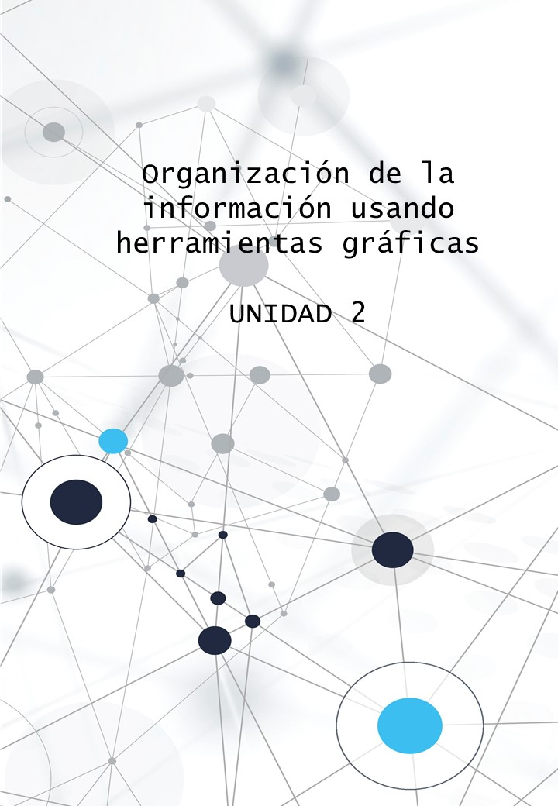

```{r setup, include=FALSE,}
library(knitr)
library(ggplot2)
knitr::opts_chunk$set(
	echo = T,
	fig.align = "center",
	message = FALSE,
	warning = FALSE
)
```

```{r, echo=FALSE, out.width="100%"}

```

# Introducción

La presentación de datos y resultados de análisis estadísticos por medio de gráficos es considerada una tarea importante en el proceso de comunicación de ideas o conclusiones. Usualmente cuando alguien recibe en sus manos un documento con gráficos, la primera mirada se dirige a éstos.

Los gráficos estadísticos son importantes en los distintos momentos del análisis de los datos. En una primera instancia son muy útiles para complementar medidas de resumen y tomar conocimiento de la estructura de los mismos, descubrir patrones o tendencias, o bien detectar situaciones anómalas. Si el estudio es observacional o exploratorio, los gráficos pueden ayudarnos a generar futuras preguntas de investigación. Luego en la parte de modelado, son importantes para verificar el desempeño de los modelos y verificar sus supuestos. Por último, en la etapa final, un gráfico correctamente diseñado puede ayudar a resumir y comunicar los principales hallazgos del estudio.

La siguiente cita de [John Tukey](https://es.wikipedia.org/wiki/John_W._Tukey) resume lo anterior:

> Un gráfico puede valer más que mil palabras, pero puede tomar muchas palabras para hacerlo John W. Tukey

En esta unidad veremos como esas *palábras* requeridas para hacer el gráfico se traducen en líneas de código en **R**.

## Principios para crear gráficos

Una ventaja de los gráficos es que pueden mostrarnos cosas que de otra forma es muy difícil o imposible ver, ésta es una de las razones por las cuales casi todos los análisis estadísticos deberían comenzar con gráficos. [Correa y Gonzales (2002)](https://cran.r-project.org/doc/contrib/grafi3.pdf), enuncian los siguientes principios a considerar al momento de presentar un gráfico:

> **Entendibilidad** ¿Nos permite el gráfico visualizar las relaciones entre las variables? ¿Interactúan los elementos en el gráfico para maximizar nuestra percepción de las relaciones entre las variables?

> **Claridad** ¿Son los elementos del gráfico claramente distinguibles? ¿Son los elementos más importantes del gráfico visualmente prominentes?

> **Consistencia** ¿Son los elementos de los gráficos consistentes con su uso en gráficos anteriores? ¿Existen nuevos elementos del gráfico que requieren una descripción adicional?

> **Eficiencia** ¿Están los elementos del gráfico representando eficientemente los datos? ¿Hay elementos en el gráfico que sirven a más de un propósito?

> **Necesidad** ¿Es el gráfico una forma útil de representar estos datos? ¿Es cada elemento en el gráfico necesario?

## Elementos de un gráfico

También los mismos autores identifican los elementos básicos de un gráfico estadístico:

-   Títulos: principal y secundarios (si son necesarios)
-   Descripción del Gráfico, generalmente en la descripción al pie de la figura.
-   Región de datos y símbolos
-   Ejes (horizontal, vertical o ambos)
-   Escalas con las unidades de los ejes
-   Leyendas con el código de colores, marcas, etc.

# Sistemas de gráficos en **R**

**R** cuenta con dos sistemas para graficar: `graphics` y `grid`. Ambos vienen por defecto con la instalación de **R**.

El paquete `graphics`, tambien conocido como `base plot system`. Este paquete provee la función genérica `plot()` para hacer gráficos simples, y otras funciones para gráficos específicos (`hist()`, `barplot()`, `boxplot()`, etc.). Usa un enfoque de *papel y lápiz* por capas donde el gráfico final es una sumatoria de capas que se agregan una a la vez sin posibilidad de modificarse luego. Generalmente es OK para gráficos simples o exploratorios. Para gráficos más complejos (con subgrupos o multipanel) requiere programar más. Una desventaja es la sintaxis poco consistente.

El paquete `grid` agrega funcionalidades al sistema base para definir paneles, escalas, etc., pero no se usa directamente. Sobre estas funcionalidades se desarrollaron dos paquetes muy importantes: `lattice` y <span style="color: #CA2514;font-weight: bold;">`ggplot`</span>

El paquete `lattice`, desarrollado por Deepayan Sarkar, implementa gráficos tipo `trellis` (multipanel). `lattice` tiene un sintaxis más coherente y en vez de tener un enfoque por capas, todos los componentes del gráfico se declaran en una función. muy conveniente para gráficos condicionales pero complicada para combinar gráficos o hacer ajustes finos.

El paquete <span style="color: #CA2514;font-weight: bold;">`ggplot`</span>, desarrollado por [Hadley Wickham](http://hadley.nz/), está basado en la filosofía *Gramática de gráficos* (*grammar of graphics* , por eso `gg`). Combina los dos enfoques: *por capas* y *función*. Uno provee los datos, indica que variables asignar a las estéticas (ejes, escalas, colores, símbolos) y las geometrías o formas que se quieren graficar y <span style="color: #CA2514;font-weight: bold;">`ggplot`</span> se encarga del resto. Se puede ir agregando capas. Es muy potente para la exploración y visualización de datos en formato de tabla con filas (observaciones) y columnas (variables).

En esta unidad vamos a desarrollar las funciones de <span style="color: #CA2514;font-weight: bold;">`ggplot`</span> que forma parte del paquete [tidyverse](https://ggplot2.tidyverse.org/)

```{r echo=FALSE}
webshot::webshot("https://ggplot2.tidyverse.org/", cliprect = c(0, 0, 1000, 1080), )
```

# Gráficos con ggplot2

Como dijimos antes, <span style="color: #CA2514;font-weight: bold;">`ggplot`</span> es un paquete **R** para producir gráficos estadísticos implementando la *gramática de los gráficos*, un marco de trabajo para crear y describir visualizaciones de datos desarrollado por [Leland Wilkinson](https://www.springer.com/in/book/9780387245447) en su libro "The Grammar of Graphics" publicado en 2005. Este marco proporciona una manera sistemática de crear visualizaciones al descomponer un gráfico en diferentes componentes y definir una serie de reglas para combinarlos evitando así las limitaciones de los gráficos predefinidos. Además, <span style="color: #CA2514;font-weight: bold;">`ggplot`</span> es compatible con otros paquetes que permiten crear gráficos interactivos o animaciones.

El modelo en el que se basa <span style="color: #CA2514;font-weight: bold;">`ggplot`</span> lo hace realmente fácil de aprender: hay un conjunto simple de principios básicos y muy pocos casos especiales. También la documentación existente es muy buena y detallada ( [guía de referencia](https://ggplot2.tidyverse.org/reference/index.html), [libro](https://ggplot2-book.org/index.html) ), y cuenta con una [comunidad](http://groups.google.com/group/ggplot2) de usuarios muy activa.

En la web existen varias galerías donde se pueden ver [ejemplos](https://www.r-graph-gallery.com/) así como algunas [extensiones](https://exts.ggplot2.tidyverse.org/gallery/) avanzadas. Estos recursos son muy últiles ya que contienen el código fuente para reproducir los gráficos.

```{r, echo = F}
webshot::webshot("https://exts.ggplot2.tidyverse.org/gallery/", cliprect = c(0, 0, 1000, 2000))
```

## ¿Cómo instalar y utilizar <span style="color: #CA2514;font-weight: bold;">`ggplot`</span>?

<span style="color: #CA2514;font-weight: bold;">`ggplot`</span> es parte del meta-paquete `tidyverse` por lo tanto para instalarlo por primera vez en la computadora tenemos las siguientes alternativas:

```{r, eval = F}
# Sólamente el paquete ggplot2
install.packages("ggplot2")

# O junto con la familia tidyverse
install.packages("tidyverse")
```

Lo anterior se debe realizar por única vez si el paquete no está previamente instalado en la máquina. Para usar las funciones en una sesión de trabajo hay que cargarlo con <span style="color: #CA2514;font-weight: bold;">`library()`</span>:

```{r, eval = F}
# Solo
library("ggplot2")

# O junto con la familia tidyverse
library("tidyverse")
```

En resumen:

```{r, echo = F}

```

Cuando cargamos el paquete tidyverse utilizando la función library(), **R** va a avisarnos en la consola que está enmascarando (reemplazando) algunas funciones que ya estaban en el entorno, o bien el paquete nos devuelve algun mensaje. 

```{r, echo=FALSE}

library(tidyverse)

```
Por ejemplo, en este caso nos indica que la función **filter()** del paquete **dplyr** está enmascarando la función **filter()** del paquete **stats**. Además, nos indica bajo que versión de **R** se construyó la última versión del paquete. 

A menos que diga `Error ...`, eso está bien.

## Gramática de gráficos

En líneas generales el concepto de gramática de gráficos es una forma describir los componentes de un gráfico de manera tal que permita su generalización. Como se mencionó previamente, este concepto fue propuesto por Leland Wilkinson quien describe una serie de reglas que definen como estos componentes del gráfico *mapean* las distintas características de los datos (variables, observaciones). El paquete <span style="color: #CA2514;font-weight: bold;">`ggplot`</span> implementa una variante *por capas* de este paradigma (`gg` es por *grammar of graphics*). Como resultado, se crean una serie de capas que permiten describir y construir visualizaciones de manera estructurada en cuanto a representación de los elementos pero a su vez flexible para generar combinaciones nuevas.

### Componentes en <span style="color: #CA2514;font-weight: bold;">`ggplot`</span>

Los gráficos de <span style="color: #CA2514;font-weight: bold;">`ggplot`</span> se definen por la combinación de capas (<span style="color: #CA2514;font-weight: bold;">`layers`</span>), escalas (<span style="color: #CA2514;font-weight: bold;">`scales`</span>), coordenadas (<span style="color: #CA2514;font-weight: bold;">`coords`</span>) y facetas (<span style="color: #CA2514;font-weight: bold;">`facets`</span>). Adicionalmente a estos componentes se pueden aplicar temas (<span style="color: #CA2514;font-weight: bold;">`themes`</span>) que permiten controla los detalles del diseño de la visualización.

Los <span style="color: #CA2514;font-weight: bold;">`layers`</span> constan de 5 elementos: los datos (`data`), los elementos de mapeo (`mapping`), la transformación estadística (`stat`), la geometría (`geom`), y el ajustes de posición (`position`). Generalmente, sobre todo para gráficos simples, `data` y `mapping` se definen una vez para todo el gráfico dentro de la función `ggplot()`. En otras situaciones se da a nivel de cada `layer` o capa. Los layers se construyen con las funciones `geom_*` y `stat_*` que veremos más adelante.

-   El <span style="color: #CA2514;font-weight: bold;">`data`</span> es un set de datos que contiene la información que se desea visualizar en la capa. Generalmente es un objeto tipo `data.frame` o similar, e.g. `tibble`. En algunos casos se pueden combinar varios set de datos definidos para cada capa.

-   Los elementos de mapeo o `mapping` son definidos mediante <span style="color: #CA2514;font-weight: bold;">`aes()`</span> para indicar la forma en que las variables y observaciones van a ser representadas en la visualización mediante propiedades visuales (ejes x e y, lineas, colores, rellenos, etc.). 

-   Los <span style="color: #CA2514;font-weight: bold;">`geoms`</span> o geometrías representan la parte visual un gráfico: puntos, líneas, polígonos, etc.

-   Las <span style="color: #CA2514;font-weight: bold;">`stats`</span> son los algoritmos utilizados para calcular nuevos valores para un gráfico. Estos aplican transformaciones estadísticas a los datos. Por ejemplo, pueden resumir los datos calculando el promedio, agrupando datos, calculando frecuencias, o ajuste de un modelo lineal o suavizado. Para saber qué transformación estadística utiliza un `geom` puede inspeccionarse el valor predeterminado del argumento `stat`. Por ejemplo, `?geom_bar` muestra que el valor predeterminado para `stat` es **count**, lo que significa que geom_bar() usa stat_count(). 

-   Los ajustes de posición (<span style="color: #CA2514;font-weight: bold;">`position`</span>) permiten controlar la posición de los elementos `geoms` dentro de un layer para evitar su superposición o

-   Las <span style="color: #CA2514;font-weight: bold;">`scales`</span> asignan los valores del espacio de datos a valores en el espacio de los elementos estéticos (`aesthetics` o `aes`). Por ejemplo, el uso de un color, forma o tamaño de en un `geom` puede ser controlado por un atributo de los datos. Las escalas también definen las leyenda y los ejes.

-   Sistema de coordenadas (<span style="color: #CA2514;font-weight: bold;">`coord`</span>) que define que variables definirán el espacio del gráfico y como se representarán, e.g. coordenadas cartesianas, polares, etc.

-   Paneles (<span style="color: #CA2514;font-weight: bold;">`facets`</span>) es un elemento que permite especificar una o más variables para dividir el gráfico en paneles y así mostrar subgrupos de datos. Esto permite ver visualizar relaciones condicionales entre variables, e.g. `y ~ x | z`, es decir, que pasa con la variable `x` e `y` cuando cambia `z`.

Adicionalmente a estos componentes se pueden aplicar temas (<span style="color: #CA2514;font-weight: bold;">`themes`</span>) que permiten controlar los detalles del diseño de la visualización, tipografía, posición de algunos objetos, paleta de colores, etc. Los valores predeterminados de <span style="color: #CA2514;font-weight: bold;">`ggplot`</span> son un buen punto de partida pero exiten opciones predefinidas que pueden modificarse para generar un tema particular.

## Primer gráfico paso a paso

Veamos con un ejemplo como se combinan los componentes anteriormente vistos para realizar un gráfico simple. Para esto vamos a usar el set de datos `iris` que viene por defecto en **R**. Este set de datos contiene mediciones de la estructura floral de tres especies del género *Iris*.

```{r}
data(iris)
head(iris)
```

Nuestro primer gráfico tendrá como objetivo mostrar la relación que existe entre las características de la flor `Sepal.Width` (ancho del sépalo) y `Sepal.Length` (longitud del sépalo), y potencialmente ver si esta es similar entre especies. Veamos paso por paso como se construye el gráfico.

Primero definimos el set de datos que usaremos:

```{r}
ggplot(data = iris)
```

Como vemos esto no produjo nada ya que no indicamos cuales son las variables que queremos graficar y cómo graficarlas. Nuestro `layer` solo tiene la información de `data`. Agreguemos ahora la información acerca de las variables que queremos mapear a los ejes x e y del gráfico con `aes()`. Usando el operador `+` podemos concatenarlo al comando anterior.

```{r}
ggplot(data = iris) +
  aes(x = Sepal.Width, y = Sepal.Length)
```

Aquí vemos que, si bien no hemos graficado nada, la información suministrada permite a `ggplot` identificar los ejes, definir el espacio de coordenadas (cartesianas por defecto) y proponer unos límites en función del rango de valores de las variables. 

Agreguemos ahora la geometría: en este caso tiene sentido usar <span style="color: #CA2514;font-weight: bold;">`geom_point()`</span> ya que queremos mostrar un punto por cada observación.

```{r}
ggplot(data = iris) +
  aes(x = Sepal.Width, y = Sepal.Length) +
  geom_point()
```

Como vemos ahora el gráfico va tomando forma. Este tipo de gráficos se llama *gráfico de dispersión* y muestra la relación entre dos variables numéricas. Por defecto no se aplica ninguna transformación estadística, cada punto representa los valores de largo y ancho de sépalo que se encuentran en el data frame, lo que equivale a <span style="color: #CA2514;font-weight: bold;">`stat = "identity"`</span>.

A este gráfico vamos a agregarle alguna función que permita resumir la relación entre ambas variables, por ejemplo un modelo de regresión. La mejor forma de representarlo sería una línea. Para eso vamos a agregar otro `layer` con <span style="color: #CA2514;font-weight: bold;">`geom_line()`</span> donde indicaremos una transformación de los datos <span style="color: #CA2514;font-weight: bold;">`stat = smooth`</span>. La transformación **smooth** produce una función aproximada que intenta capturar patrones importantes en los datos, dejando de lado el ruido. Agregando el parámetro `method = "lm"` (linear model) le pido que estime la recta de regresión de la variable dependiente `sepal.width`, dado el regresor `sepal.length`.


```{r}
ggplot(data = iris) +
  aes(x = Sepal.Width, y = Sepal.Length) +
  geom_point() +
  geom_line(stat = 'smooth', method = 'lm')
```

Esta relación casi nula o negativa es para todo el set de datos y puede enmascarar algún patrón por especies. Agreguemos la información de `Species` al gráfico utilizando otros atributos estéticos, en este caso el <span style="color: #CA2514;font-weight: bold;">`color`</span> de los puntos:

```{r}
ggplot(data = iris) +
  aes(x = Sepal.Width, y = Sepal.Length, color = Species) +
  geom_point() +
  geom_line(stat = 'smooth', method = 'lm')
```

De este gráfico surge que la relación en realidad es positiva para todas las especies!

Dependiendo el tipo de `geom` tenemos distintos atributos estéticos para explorar: `color` y `alpha` (transparencia) para todos, `shape` y `size` para puntos, `linewidth` y `linetype` para lineas, y `fill` para barras, etc. Que tipo de atributo estético depende también de la naturaleza de la variable: continua o discreta. Veamos como queda mapear los valores de `Species` al atributo `shape` (forma):

```{r}
ggplot(data = iris) +
  aes(x = Sepal.Width, y = Sepal.Length, shape = Species) +
  geom_point() +
  geom_line(stat = 'smooth', method = 'lm')
```

Las estéticas se pueden combinar para mostrar mas relaciones entre variables. Por ejemplo, además de `shape = Species` podríamos agregar la información de los pétalos como tamaño y color:

```{r}
ggplot(data = iris) +
  aes(x = Sepal.Width, y = Sepal.Length, shape = Species, 
      size = Petal.Width, color = Petal.Length) +
  geom_point() +
  geom_line()
```

Claramente esto es una exageración pero muestra la potencialiadad del gráfico. Siempre hay que tener en cuenta los principios vistos al principio, balance entre simplicidad del gráfico y la cantidad de información que queremos comunicar.

Finalmente vamos a ver como mejorar los nombres de los ejes, leyendas y agregar un título. Esto lo hacemos con `labs()`. También agregamos algún tema predefinido o como `theme_bw()`.

```{r}
ggplot(data = iris) +
  aes(x = Sepal.Width, y = Sepal.Length, shape = Species, 
      size = Petal.Width, color = Petal.Length) +
  geom_point() +
  geom_line() +
  labs(x = "Sepal width (cm)", y = "Sepal length (cm)",
       color = "Petal length (cm)", size = "Petal width (cm)",
       shape = "Species", title = "My first plot") +
  theme_bw()
```

## Geometrías: los bloques para construir gráficos

Existen muchas geometrías disponibles en el paquete <span style="color: #CA2514;font-weight: bold;">`ggplot`</span>. El [sitio web de referencia](https://ggplot2.tidyverse.org/reference/) contiene el listado exhaustivo de las opciones que tenemos para representar distintos tipos de datos. Como vimos antes, estos `geoms` son atajos del comando `layer()` para agregar capas a nuestro gráfico combinando `data`, `mapping`, `stats` y `position`. Pueden usarse como unico layer del gráfico o bien combinarse para crear visualizaciones mas complejas.

Algunos de `geoms` más comunes son:

-   <span style="color: #CA2514;font-weight: bold;">`geom_point()`</span>, lo vimos anteriormente, cada dato se representa por un punto en el sistema de coordendas. Una variante es <span style="color: #CA2514;font-weight: bold;">`geom_jitter()`</span> que permite agregar una variabilidad aleatoria para evitar que se superpongan los puntos cuando el eje x es discreto.

-   <span style="color: #CA2514;font-weight: bold;">`geom_line()`</span> dibujan líneas uniendo puntos de izquierda a derecha. Una variante es<span style="color: #CA2514;font-weight: bold;">`geom_path()`</span>` que une puntos en función de su orden en el set de datos. Las líneas se utilizan normalmente para explorar cómo cambian las cosas con el tiempo.

-   <span style="color: #CA2514;font-weight: bold;">`geom_smooth()`</span> permite ajustar distintos modelos para mostrar la tendencia de los datos en forma de linea con opción a agregar información de los errores. Es un atajo para combinar `geom_line()` y `stat_smooth()`.

-  <span style="color: #CA2514;font-weight: bold;">`geom_boxplot()`</span> produce un diagrama de caja y bigotes para resumir la distribución de un conjunto de datos usando medidas de resumen robustas (mediana, cuartiles, etc.) y detectar valores atípicos.

-   <span style="color: #CA2514;font-weight: bold;">`geom_histogram()`</span> y <span style="color: #CA2514;font-weight: bold;">`geom_freqpoly()`</span> muestran la distribución de variables continuas agrupándola en clases o intervalos. Si hay muchos datos <span style="color: #CA2514;font-weight: bold;">`geom_density()`</span> puede ser una alternativa.

-   <span style="color: #CA2514;font-weight: bold;">`geom_bar()`</span> y <span style="color: #CA2514;font-weight: bold;">`geom_col()`</span> nos permiten hacer gráficos de barras apiladas o a la par. La ultima es un atajo de la primera. Sirve para graficar frecuencias de variables categóricas o medidas de resumen de variables contínuas por grupos.

Algunos de los `stats` más utilizados:

- <span style="color: #CA2514;font-weight: bold;">`stat_identity()`</span>: Toma los datos directamente de la base, sin modificarlos. Utilizamos stat = identity cuando queremos graficar los valores que se encuentran en las celdas de nuestra matríz de datos. 

- <span style="color: #CA2514;font-weight: bold;">`stat_count()`</span>: Cuenta la cantidad de casos para cada valor de la variable. Utilizamos stat = count cuando queremos graficar frecuencias.

- <span style="color: #CA2514;font-weight: bold;">`stat_smooth()`</span>: Calcula medias condicionales según algún método de suavizado (lm, loess, gam).

- <span style="color: #CA2514;font-weight: bold;">`stat_bin()`</span>: Divide una variable continua en intervalos (bins) y cuenta cuantas observaciones corresponden a cada intervalo. 

- <span style="color: #CA2514;font-weight: bold;">`stat_density()`</span>: Calcula y extrae una estimación de la densidad del kernel.

- <span style="color: #CA2514;font-weight: bold;">`stat_summary()`</span>: Calcula medidas de resumen como media, desvío, etc.  

```{r, echo=FALSE}
geoms <- data.frame(Geometría = c("geom_bar()", "geom_col()", "geom_point()", "geom_path()", "geom_line()", "geom_smooth()",
                             "geom_freqpoly()", "geom_histogram()", "geom_density()"),
                    
                    `stat` = c("count", "identity", "identity", "identity", "identity", "smooth", "bin", "bin", "density")
)

knitr::kable(geoms, col.names = c("Geometría", "Transformación estadística por defecto"))
```

Veamos en detalle estos gráficos y algunos más avanzados.

### Gráficos de puntos

Este es el clásico gráfico de dispersión donde podemos representar como mínimo dos variables continuas que definen un espacio de coordendas. Esto lo vimos al graficar la relación entre `Sepal.Width` y `Sepal.Length`

```{r}
ggplot(data = iris) +
  aes(x = Sepal.Width, y = Sepal.Length) +
  geom_point() +
  labs(x = "Sepal width (cm)", y = "Sepal length (cm)",
       title = "Gráfico de dispersión")
```

Alternativamente este gráfico de puntos puede mostrar la relación de una variable cuantitativa (e.g. `Sepal.Width`) con alguna cualitativa (e.g. `Species`)

```{r}
ggplot(data = iris) +
  aes(x = Species, y = Sepal.Width) +
  geom_point() +
  labs(x = "Species", y = "Sepal width (cm)",
       title = "Gráfico de dispersión")
```

En este caso tiene sentido agregar un ruido aleatorio a la posición sobre el eje X para evitar la superposición de puntos.

```{r}
ggplot(data = iris) +
  aes(x = Species, y = Sepal.Width) +
  geom_jitter(width = 0.1) +
  labs(x = "Species", y = "Sepal width (cm)",
       title = "Gráfico de puntos")
```

Sobre este gráfico podríamos agregar una estadística de resumen, por ejemplo la media:

```{r}
ggplot(data = iris) +
  aes(x = Species, y = Sepal.Width) +
  geom_jitter(width = 0.1) +
  geom_point(stat = "summary", fun = mean, color = "red") +
  labs(x = "Species", y = "Sepal width (cm)",
       title = "Gráfico de puntos")
```

Este tipo de gráficos nos da pie para pensar en agregar otras medidas de resumen que es el gráfico que vemos a continuación.

### Boxplot o diagramas de cajas

Cuando un conjunto de datos incluye una variable categórica y una o más variables continuas, probablemente es de interés como cómo varían los valores de las variables continuas con los niveles de la variable categórica. El gráfico anterior de algún modo mostraba eso.

Cuando tenemos suficiente cantidad de datos para cada categóría, un gráfico muy util es el gráfico de caja o *boxplot*. Este gráfico inventado por [John Tukey](https://vita.had.co.nz/papers/boxplots.pdf) hace 40 años pero sigue siendo vigente y muy potente. Se construye a partir de medidas posición robustas: mediana, cuartiles, etc. Permite visualizar dispersion de los datos, la tendencia central y detectar valores atípicos. Veamos un ejemplo con `Petal.Length`.

```{r}
ggplot(data = iris) +
  aes(x = Species, y = Petal.Length) +
  geom_boxplot() +
  labs(x = "Species", y = "Petal length (cm)",
       title = "Boxplot")
```

Por defecto `geom_boxplot()` usa un factor de escala de 1.5 y muestra los valores atípicos y *outliers* leves y extremos. Si solo queremos aquellos outliers *extremos*, es necesario indicar `coef = 3`

```{r}
ggplot(data = iris) +
  aes(x = Species, y = Petal.Length) +
  geom_boxplot(coef = 3) +
  labs(x = "Species", y = "Petal length (cm)",
       title = "Boxplot")
```

Como vemos los valores outliers antes indicados desaparecen porque son valores atípicos leves, i.e. están entre las vallas internas y externas.

El gráfico de caja puede combinarse con otros `geoms`, por ejemplo, agregando la media con `stat = 'summary', fun = mean`:

```{r}
ggplot(data = iris) +
  aes(x = Species, y = Petal.Length) +
  geom_boxplot(coef = 3) +
  geom_point(stat = "summary", fun = mean, color = "red") +
  labs(x = "Species", y = "Petal length (cm)",
       title = "Boxplot")
```

O podemos agregarle los puntos observados, con un poco de desplazamiento que vimos en `geom_jitter()`:

```{r}
ggplot(data = iris) +
  aes(x = Species, y = Petal.Length) +
  geom_boxplot(coef = 3) +
  geom_point(stat = "summary", fun = mean, color = "red") +
  geom_jitter() +
  labs(x = "Species", y = "Petal length (cm)",
       title = "Boxplot recargado")
```

### Gráfico de tipo violín

Siguiendo con la idea de ver la distribución de los datos, otra alternativa muy popular, sobre todo cuando los datos son muchos, es representar de manera compacta la *densidad* de la distribución, destacando las áreas donde se encuentran más puntos.

```{r}
ggplot(data = iris) +
  aes(x = Species, y = Petal.Length) +
  geom_violin() +
  geom_point(stat = "summary", fun = mean, color = "red") +
  labs(x = "Species", y = "Petal length (cm)",
       title = "Violin plot")
```

En este gráfico, al igual que en el boxplot, se ve claramente donde se concentran los datos.

### Histogramas, poligonos de frecuencia y densidad

Una forma clásica de ver la distribución de los datos cuantitativos es el *histograma*. Esto se logra agrupando las observaciones en en clases o intervalos y luego contando la cantidad de obervaciones dentro de cada intervalo. De esta manera en el eje X se tiene el rango de valores y en el eje Y se representan las frecuencias, que pueden ser absolutas o relativas (%).

Veamos como se distribuye la longitud de los pétalos primero ignorando la especie:

```{r}
ggplot(data = iris) +
  aes(x = Petal.Length) +
  geom_histogram() +
  labs(x = "Petal length (cm)",
       title = "Histograma")
```

Aquí vemos que los datos tienen al menos 2 grupos bien definidos. Usando el argumento `binwidth` y `bins` podemos controlar el ancho y el número de clases.

Si agregamos la especie usando `fill` o `color` podemos diferenciar entre *S. versicolor* y *S. virginica*.

```{r}
ggplot(data = iris) +
  aes(x = Petal.Length, fill = Species) +
  geom_histogram() +
  labs(x = "Petal length (cm)",  fill = "Species",
       title = "Histograma")
```

Cuando los grupos se superponen esta visualización no es muy útil. Una alternativa es usar `geom_frepoly()` para obtener un contorno del histograma que permita ver grupos superpuestos.

```{r}
ggplot(data = iris) +
  aes(x = Petal.Length, color = Species) +
  geom_freqpoly() +
  labs(x = "Petal length (cm)",  fill = "Species",
       title = "Polígono de frecuencias")
```

Ahi vemos bien el detalle donde se superponen estas dos especies. La forma de los polígonos dependen del grado de detalle que le demos eligiendo el numero y ancho de clases.

Una alternativa al polígono de frecuencia es la gráfica de densidad, `geom_density ()`. Estas gráficas de densidad son más difíciles de interpretar ya que los cálculos subyacentes son más complejos y ademas hacen suposiciones que no son ciertas para todos los datos, por ejemplo la distribución subyacente es continua, ilimitada y fluida.

```{r}
ggplot(data = iris) +
  aes(x = Petal.Length, color = Species) +
  geom_density() +
  labs(x = "Petal length (cm)",  fill = "Species",
       title = "Densidades")
```

### Graficos de barras o columnas

Estos tipos de gráficos se realizan con las funciones: `geom_bar()` y `geom_col()`. La diferencia radica en el tipo de `stat` que se calcula y representa en la altura de las barras.

`geom_bar()` hace que la altura de la barra sea proporcional al número de casos en cada grupo (o si se proporciona la estética del peso, la suma de los pesos) y por lo tanto usa `stat_count()`. Esto es de utilidad para cuando queremos hacer un gráfico de frecuencias de una variable discreta.

```{r message=FALSE, warning=FALSE}
ggplot(data = iris) +
  aes(x = Species) +
  geom_bar() +
  labs(title = "Frecuencia especies")
```

En este caso el gráfico es poco atractivo ya que el set de datos tiene 50 casos para cada especie.

Por su parte, `geom_col()` sirve para representar datos únicos en la altura de las barras ya que usa `stat = "identity"` y deja los datos como están. Si por cada valor de x tenemos varios datos éstos se van a agregar y se muestra el total.

```{r}
ggplot(data = iris) +
  aes(x = Species, y = Petal.Length) +
  geom_col() +
  labs(title = "Sumatoria de longitud de pétalos",
       y = "Total Petal length (cm)")
```

Este gráfico a priori no tiene sentido ya que el eje y muestra la sumatoria de la longitud de petalos de las 50 observaciones de cada especie. Para mostrar una medida de resumen se debe combinar `geom_bar()` con `stat = "summary"`

```{r}
ggplot(data = iris) +
  aes(x = Species, y = Petal.Length) +
  geom_bar(stat = "summary", fun = mean) +
  labs(title = "Longitud promedio de los pétalos (cm)",
       x = "Especie")
```

### Graficos medias e intervalos

Una opción muy común es agregar una medida de variabilidad o incertidumbre cuando las barras o puntos representan medidas de tendencia central. Supongamos que queramos tener para cada especie el largo de pétalo medio y un intervalo que represente el desvió estándar respecto a esa medida de resumen. Primero necesitamos obtener las estadísticas descriptivas. Para esto podemos usar `dplyr`

```{r}
library(dplyr)
meds_sd <- group_by(iris, Species) %>% 
  summarise(ybar = mean(Petal.Length), s = sd(Petal.Length))
meds_sd
```

Luego usamos ese nuevo data frame para construir la visualización con `geom_col()` mas un layer `geom_errorbar()`. Este nuevo layer agrega más atributos estéticos para mapear.

```{r}
ggplot(data = meds_sd) +
  aes(x = Species, y = ybar, ymin = ybar - s, ymax = ybar + s) +
  geom_col() +
  geom_errorbar(width  = 0.1) +
  labs(title = "Longitud promedio de los pétalos (cm)",
       x = "Especie", y = "Longitud promedio de los pétalos (cm)")
```

Otra opción es usar la geometría `geom_pointrage()`:

```{r}
ggplot(data = meds_sd) +
  aes(x = Species, y = ybar, ymin = ybar - s, ymax = ybar + s) +
  geom_pointrange() +
  labs(title = "Longitud promedio de los pétalos (cm)",
       x = "Especie", y = "Longitud promedio de los pétalos (cm)")
```

Finalmente podríamos agregar sobre este gráfico los puntos originales con un color distinto. Como combinamos dos set de datos distintos conviene definir `data` y `aes` en cada layer. De paso probemos el tema `theme_classsic()`.

```{r}
ggplot() +
  geom_jitter(
    data = iris, 
    aes(x = Species, y = Petal.Length),
    color = "gray", width = 0.1
  ) +
  geom_pointrange(
    data = meds_sd, 
    aes(x = Species, y = ybar, ymin = ybar - s, ymax = ybar + s)
  ) +
  labs(title = "Longitud promedio de los pétalos (cm)",
       x = "Especie", y = "Longitud promedio de los pétalos (cm)") +
  theme_classic()
```

### Gráficos de torta

Finalmente, una opción popular para representar datos categóricos es el famoso gráfico de torta o sectores o *pie chart*. Aunque este tipo de gráficos es muy conocido, existe un amplio [criticismo](https://www.bernardmarr.com/default.asp?contentID=1779) y se aconseja solo cuando las categorías son pocas.

Desde el punto de vista de la *gramática de gráficos*, este gráfico es un gráfico de barras o columnas representado usando coordenadas polares. Veamos como transformar el gráfico de barras representando frecuencias de especies en un gráfico de torta usando `coord_polar()` y algunos extras:

```{r}
ggplot(data = iris) +
  aes(x = "", fill = Species) +
  geom_bar(width = 1, color = "white") +
  coord_polar("y") +
  labs(title = "Frecuencia especies") +
  theme_void()
```

En este caso, `theme_void()` nos permite eliminar algunos componentes del gráfico (fondo, grilla, etiquetas numéricas, ejes) que generalmente no se usan en este típo de visualización.

### Gráficos de texto

Así como se usaron puntos para representar los datos en un gráfico de dispersión y otras variables que definen grupos se incluyeron como colores, rellenos, etc., es posible directamente usar el identificador del caso o el grupo al que pertenece la observación como una geometría usando `geom_text()`.

```{r}
ggplot(data = iris) +
  aes(x = Sepal.Width, y = Sepal.Length) +
  geom_text(aes(label = Species)) +
  labs(x = "Sepal width (cm)", y = "Sepal length (cm)")
```

En casos como éste donde hay una superposición importante de los rótulos, y además los rótulos se repiten mucho (hay solo 3 especies en 150 observaciones), es más eficiente manejar una escala de colores como vimos antes.

No obstante, si de todos modos quisíeramos mejorar esta distribución de rótulos evitando superposición, podríamos usar el paquete `ggrepel` que tiene funciones para evitar superposición.

```{r}
# Instalar ggrepel si no está instalado
# install.packaes('ggrepel')

# Cargar ggrepel
library(ggrepel)

# Gráfico con ggrepel::geom_text_repel()
ggplot(data = iris) +
  aes(x = Sepal.Width, y = Sepal.Length) +
  geom_text_repel(aes(label = Species)) +
  labs(x = "Sepal width (cm)", y = "Sepal length (cm)",
       title = "Gráfico de dispersión")
```

Como comentamos antes, en este caso se esta forzando el algoritmo y hay muchos puntos que al superponerse demasiado son omitidos. Esto se controla con `max.overlaps`.

### Algunos extras

Las geometrías anteriormente vistas se pueden combinar en distintas formas. Algunas constituyen en si mismas algunas visualizaciones estándar (e.g. histograma, boxplot). Otras al combinarse crean visualizaciones únicas.

A continuación se muestran algunas geometrías extra comúnmente usadas:

Por ejemplo, podemos graficar lineas verticales, horizontales o con una determinada orientación. Tomando el ejemplo de las medias de longitud de pétalos por especie se podría pensar en agregar la media general de la longitud de los pétalos combinando la información de las tres especies. Esto se hace con `geom_hline()`.

```{r}
ggplot() +
  geom_jitter(
    data = iris, 
    aes(x = Species, y = Petal.Length),
    color = "gray", width = 0.1
  ) +
  geom_pointrange(
    data = meds_sd, 
    aes(x = Species, y = ybar, ymin = ybar - s, ymax = ybar + s)
  ) +
  geom_hline(data = iris, aes(yintercept = mean(Petal.Length))) +
  labs(title = "Longitud promedio de los pétalos (cm)",
       x = "Especie", y = "Longitud promedio de los pétalos (cm)") +
  theme_classic()
```

Se pueden usar varias lineas de referencia, incluso por paneles. Otro ejemplo sería agregar una linea 1:1 con `geom_abline()` a un gráfico de dispersión entre el largo y ancho de los pétalos. En este caso tendría una ordenada al origen 0 y pendiente 1

```{r}
ggplot(iris) +
  aes(x = Petal.Length, y = Petal.Width) +
  geom_point() +
  geom_abline(slope = 1, intercept = 0) +
  labs(title = "Relacion entre longitud y ancho de los pétalos", x = "Longitud de los pétalos (cm)",
       y = "Ancho de los pétalos (cm)") +
  lims(x = c(0, 8), y = c(0,8)) +
  theme_classic()
```

Aquí puede verse que la relación es menor a 1.

## Sistemas de coordendas

Como vimos antes para el gráfico de torta, podemos usar el componente <span style="color: #CA2514;font-weight: bold;">`coords`</span> para definir cambios en el sistema de coordenadas de un gráfico. Por defecto siempre se asume que las coordenadas son cartesianas (`coord_cartesian()`) donde hay ejes X e Y.

Otra alternativa es utilizar un sistema de coordenadas polares (`coord_polar()`) para gráficos de torta y gráficos tipo tela de araña o radar.

Existen algunos atajos útiles para modificar el sistema de coordenadas como por ejemplo `coord_flip()` que permite rotar el gráfico 90°.

```{r}
ggplot(data = iris) +
  aes(x = Species, y = Petal.Width) +
  geom_bar(stat = "summary", fun  = mean) +
  coord_flip() 
```

O `coord_fixed()` que permite ajustar ambos ejes para mantener un determinado aspecto controlado por `ratio`. Por ejemplo, para hacer un gráfico que muestre la relación entre las dimensiones de los pétalos en una escala 2 a 1, es decir, 2 unidades en el eje `y` representan 1 unidad en `x`. Si la relación deseada es 1:1 entonces `coord_equal()` es un atajo útil.

```{r}
ggplot(data = iris) +
  aes(x = Petal.Length, y = Petal.Width) +
  geom_point(stat = "summary", fun  = mean) +
  coord_fixed(ratio = 2)
```

También se pueden aplicar transformaciones específicas a cada eje con `coord_trans()`. Veamos en el caso anterior como podríamos expresar `Petal.Width` en escala logarítmica y `Petal.Length` en escala de raíz cuadrada.

```{r}
ggplot(data = iris) +
  aes(x = Petal.Length, y = Petal.Width) +
  geom_point(stat = "summary", fun  = mean) +
  coord_trans(y = "log10", x = "sqrt") 
```

En este caso no tiene mucho sentido pero para variables con distribuciones muy asimétricas, estas transformaciones pueden mostrar una relación fácil de modelar linealmente.

## Gráficos condicionales o por paneles: <span style="color: #CA2514;font-weight: bold;">`facets`</span>

Todo lo anteriormente visto puede aplicarse tanto para un gráfico único como para uno dividido en subgraficos o paneles. Esto último se hace facilmente usando una o más variables condicionales con <span style="color: #CA2514;font-weight: bold;">`facets`</span>. Este tipo de gráficos también se denomina gráficos condicionales ya que muestran la relación de al menos dos variables de interés a través de los niveles de una tercera variable: `y ~ x | z`.

Por ejemplo, en el primer gráfico vimos como mostrar la relación de las dimensiones de los sépalos usando la especie como color. Eventualmente, ese gráfico podría dividirse en 3 paneles (uno por especie) y mostrar en cada uno el subconjunto de puntos.

```{r}
ggplot(data = iris) +
  aes(x = Sepal.Width, y = Sepal.Length) +
  geom_point() +
  geom_line(stat = 'smooth', method = 'lm') +
  facet_wrap(~ Species)
```

Hay dos tipos de facetado: `facet_wrap()` y `facet_grid()`. El primero permite agregar una o mas variables condicionales pero cada subpanel se muestra secuencialmente. Funciona bien cuando tenemos una sola variable para dividir los subplots o pocos niveles en la combinación. La forma de indicar la variable es `~ variable`.

En cambio, `facet_grid()` permite organizar los subplots en filas y columnas. Las variables se indican en este orden `fila ~ columna`. Para este ejemplo vamos a crear una variable que divide las observaciones segun un largo de pétalo arbitrario y luego usar la especie y esas nueva variable para mostrar la relación de las dimensiones de los sépalos:

```{r}
# Creacion de una segunda vairable para ilustrar el ejemplo
iris$Petalo4 <- iris$Petal.Length > 4

# Gráfico usando facet_grid
ggplot(data = iris) +
  aes(x = Sepal.Width, y = Sepal.Length) +
  geom_point() +
  geom_line(stat = 'smooth', method = 'lm') +
  facet_grid(Petalo4 ~ Species)
```

Aquí vemos como las especies quedaron en columnas y se generaron dos filas de acuerdo a si las observaciones tenían una longitud de pétalo mayor a 4 cm.

Por defecto los subplots o <span style="color: #CA2514;font-weight: bold;">`facets`</span> tienen escalas iguales en ambos ejes. A veces conviene dejar una o las dos escalas variar libremente, esto se hace con el argumento <span style="color: #CA2514;font-weight: bold;">`scales`</span> y las palabras clave `'free_y'`, `'free_x'` o `'free'` (ambas a la vez).

```{r}
ggplot(data = iris) +
  aes(x = Sepal.Width, y = Sepal.Length) +
  geom_point() +
  geom_line(stat = 'smooth', method = 'lm') +
  facet_wrap(~ Species, scales = "free")
```

Otra aspecto importante en la visualización usando facets es el texto que identifica cada panal. Esto depende de cómo están configurados los datos y se controla con el argumento `labeller`. Por defecto se toma el valor del factor que se usa para definir los grupos. En algunos casos conviene incluir el nombres de la variable.

```{r}
ggplot(data = iris) +
  aes(x = Sepal.Width, y = Sepal.Length) +
  geom_point() +
  geom_line(stat = 'smooth', method = 'lm') +
  facet_wrap(~ Species, labeller = label_both)
```

O bien construir nuestros nombres ad-hoc:

```{r}
# Vector con los nombres que queremos mostrar
lbls <- c(
  setosa = "I. setosa",
  virginica = "I. virginica",
  versicolor = "I. versicolor"
)

# Grafico con custom labels
ggplot(data = iris) +
  aes(x = Sepal.Width, y = Sepal.Length) +
  geom_point() +
  geom_line(stat = 'smooth', method = 'lm') +
  facet_wrap(~ Species, labeller = labeller(Species = lbls))
```

## Temas

Los temas en `ggplot` hacen referencia a la forma de controlar la posición, el aspecto, y las formas de los distintos componentes del gráfico. El listado de componentes que se pueden modificar en un tema se incluyen en `?theme()`. Como vemos la lista es larga ya que cada aspecto del gráfico puede controlarse permitiendo crear nuestros propios temas.

Por defecto los gráficos utilizan un tema llamado `theme_gray()` que tiene una selección de parámetros elegante y que sirve para la mayoría de los casos. No obstante, existen otros temas específicos que pueden ser de interés.

En algunos ejemplos anteriores vimos como agregar el tema blanco y negro `theme_bw()` el cual básicamente remueve el fondo gris. También vimos `theme_classic()` que introduce más modificaciones. El listado de temas se puede ver en la pagina de ayuda de cualquier tema, e.g. `?theme_gray`

Los temas pueden considerarse como un punto de partida sobre el cual podemos hacer modificaciones extra para definir nuestro propio tema. Por ejemplo, el tema `them_bw()` remueve el fondo gris pero si queremos quitar la grilla podemos hacer:

```{r}
# Modificar el tema
mi_tema <- theme_bw() + theme(panel.grid = element_blank())

# Aplicar nuestro nuevo tema.
ggplot(data = iris) +
  aes(x = Sepal.Width, y = Sepal.Length, color = Species) +
  geom_point() +
  labs(x = "Sepal width (cm)", y = "Sepal length (cm)",
       color = "Species") +
  guides(position = "bottom") +
  mi_tema
```

Otro aspecto muy util es controlar la posición de la leyenda. Esto se puede hacer con los argumentos `legend.*` dentro del tema.

```{r}
# Modificar el tema
mi_tema <- theme_bw() + theme(panel.grid = element_blank(),
                              legend.position = "bottom")

# Aplicar nuestro nuevo tema.
ggplot(data = iris) +
  aes(x = Sepal.Width, y = Sepal.Length, color = Species) +
  geom_point() +
  labs(x = "Sepal width (cm)", y = "Sepal length (cm)",
       color = "Species") +
  guides(position = "bottom") +
  mi_tema
```

Podemos encontrar los componentes a modificar de los temas aquí: https://ggplot2.tidyverse.org/reference/theme.html


## Librería `plotly`: gráficos interactivos y más llamativos

Como siempre ocurre con R, aparecen cada vez más librerías o paquetes que mejoran algunas características de los anteriores, o bien, proponen nuevas. En este caso vamos a presentar un ejemplo usando el paquete [`plotly`](https://plotly.com/r/reference). Para instalarlo:

```{r, eval = F}
# Instalación del paquete ploty
install.packages("plotly")
```

Todos los gráficos hechos con el paquete `plotly` tienen la capacidad de ser interactivos dentro del panel de gráficos de **R**, de **RStudio**, y si se incluyen dentro de un documento HTML. Si se copia el gráfico y se pega en un documento de Word, o un PDF, perderá la capacidad de ser interactivo.

Por interactivo nos referimos a la capacidad de, mediante el mouse, obtener información del gráfico o bien interactuar haciendo zoom para explorar partes especificas. Veamos un ejemplo con un gráfico de puntos.

```{r}
library(plotly)
plot_ly(data = iris, x = ~Sepal.Length, y = ~Petal.Length,
        type = "scatter", name = ~ Species)
```

Las sintaxis es un poco diferente a lo que veníamos viendo para <span style="color: #CA2514;font-weight: bold;">`ggplot`</span> pero conserva alguna lógica. Necesitamos definir el dataframe con los datos, qué variable se mapean en cada eje, en `type` el tipo de gráfico o geometría que queremos utilizar y con `name` los subgrupos.

Una opción para convertir nuestro gráfico hecho en <span style="color: #CA2514;font-weight: bold;">`ggplot`</span> en una visualización interactiva es usando la función de `ggplotly()`. Funciona bien para visualizaciones simples y con pocos layers. Hagamos el mismo gráfico anterior primero en <span style="color: #CA2514;font-weight: bold;">`ggplot`</span> y luego convirtiéndolo en `plotly`:

```{r}
# gráfico ggplot
plt <- ggplot(data = iris) + 
  aes(x = Sepal.Length, y = Petal.Length, color = Species) +
  geom_point()
plt
```

Conversión a plotly:

```{r}
ggplotly(plt)
```

Existen muchas más opciones para controlar el aspecto y comportamiento de estos gráficos, los cuales escapan al objetivo de esta unidad. La [guia de referencia](https://plotly.com/r/reference/) es un buen punto de partida.
